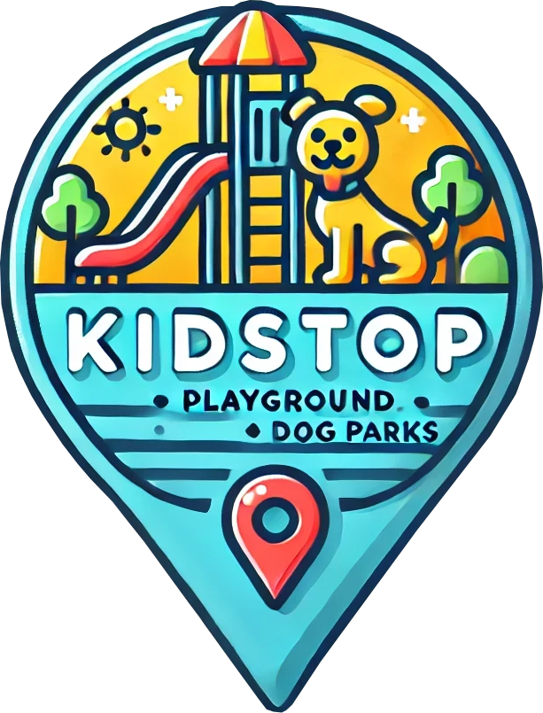

  

<h2 align="center">The KidStop</h2>

KidStop is an interactive web application built to enhance travel experiences for families by easily locating playgrounds and dog parks nearby. Developed using a React front-end and an Express back-end, KidStop seamlessly integrates with the Google Maps API and Google Places API to provide accurate, real-time location data.

Families can effortlessly discover and explore nearby parks, view detailed reviews, and even add their own favorite spots. Users have the opportunity to rate parks, share valuable feedback, and interact through comments, creating a dynamic community resource.

Whether you're on a family road trip or just exploring your neighborhood, KidStop ensures playtime is always just around the corner! You can start your journey here:

<!-- 

https://the-craft-beer-collective-30d7183bcd5d.herokuapp.com/

 -->

## Deployment Versions
<h3 align="center">Desktop</h3>

    

<h3 align="center">Mobile</h3>

    
    

## Planning Tools
**[Trello Board](https://trello.com/invite/b/67ce6f030054d892a7086735/ATTI46aadff10dd3dcccae6f7826baa630140C1CAB89/Unit%203%20Project%20-%20KidStop)**  
**GitHub:** [Back-end Repo](https://github.com/brady-newhard/kidstop-back-end)  

## Attributions
GoggleMaps and GooglePlaces API's

ChatGPT for logo

## Technologies
<h3 align="left">Languages and Tools:</h3>

!

## Future Enhancement
- Better bridge between the Google API and the KidStop reviews
- Add more features to make it a more one stop KidStop
- Built in google directions to the park
